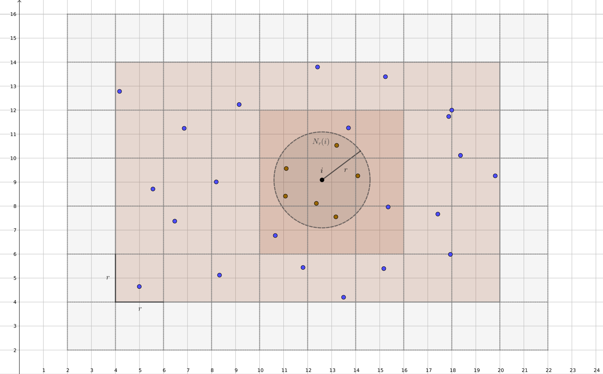

# Cell Lists


*Cell lists* is an algorithm for computing fast *fixed-radius near neighbors search*. Cell lists algorithm partitions the space contained by the points into a grid. The grid cells can be regarded as buckets in which individual points belong. By choosing the fixed-radius as the cell size, the nearest neighbors can be found from each cell or the neighboring cells of that cell.

The worst-case computational complexity, that is iterations required to find the near neighbors, of Cell lists, is better than brute force when the maximum number of points that can belong into a single cell is less than the total number of points. For example, in the case of sufficiently many finite-sized non-overlapping points.

The algorithm is implemented in Python. It relies on Numba for performance and compatibility with Numpy. The documentation of [Cell lists API](https://jaantollander.github.io/cell_lists/) is also available.


## Installation
This package can be installed directly from GitHub, but the dependencies are not included in the installation.
```bash
pip install git+https://github.com/jaantollander/cell_lists.git
```

It recommended installing the dependencies using [Conda](https://docs.conda.io/en/latest/)
```bash
conda install numpy numba
```


## Example
Example of how to use the `cell_lists` package.

```python
import numba
import numpy as np
from cell_lists import add_to_cells, neighboring_cells, iter_nearest_neighbors

@numba.jit(nopython=True, nogil=True)
def find_neighbors(cell_indices, neigh_cells, points_indices, cells_count,
                   cells_offset):
    result = []
    for i, j in iter_nearest_neighbors(cell_indices, neigh_cells,
                                       points_indices, cells_count,
                                       cells_offset):
        result.append((i, j))
    return result


# Inputs
cell_size = 0.1
points = np.random.uniform(-10, 10, size=(10, 2))

# Pre-computation
points_indices, cells_count, cells_offset, grid_shape = add_to_cells(
    points, cell_size)
cell_indices = np.arange(len(cells_count))
neigh_cells = neighboring_cells(grid_shape)

# Find near neighbors
find_neighbors(cell_indices, neigh_cells, points_indices, cells_count,
               cells_offset)
```


## Development
Clone the `cell_lists` repository
```bash
git clone https://github.com/jaantollander/cell_lists.git
```

Create Conda environment
```bash
conda env create -f environment.yml
```

Tests can be run using `pytest` command
```bash
pytest
```

Documentation can be built using Sphinx in the `docs` directory
```
make html
```
